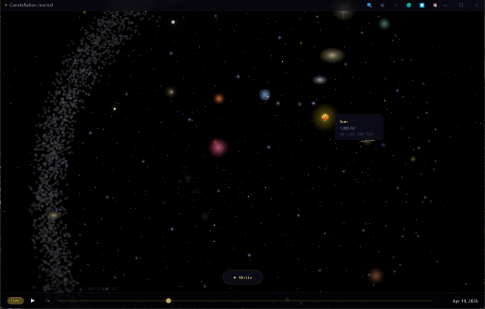
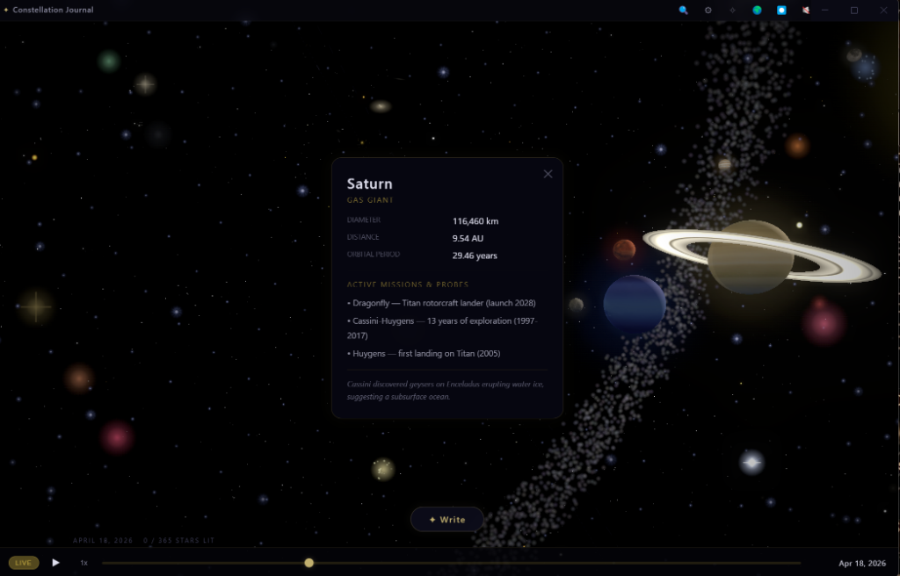
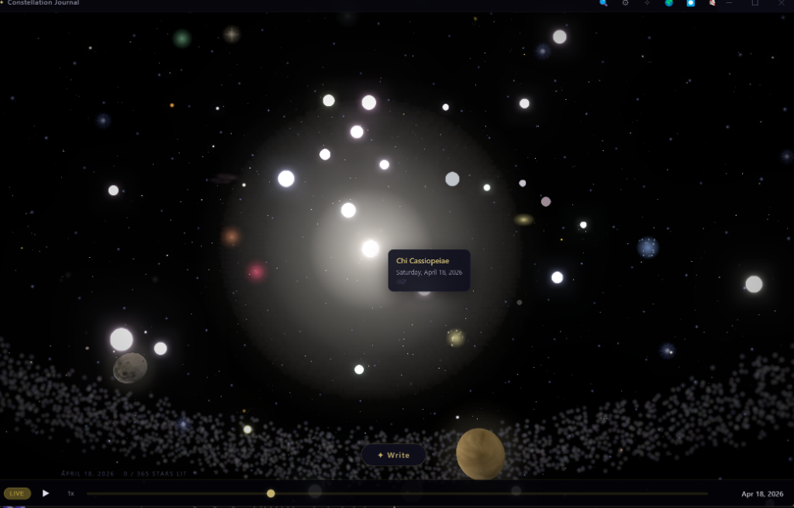

# CONSTELLATION JOURNAL

**Your year, written in stars.**

*Local only. Nothing leaves your machine. Everything leaves a mark.*

[](https://github.com/VrtxOmega)
[](https://github.com/VrtxOmega/constellation-journal)
[](https://github.com/VrtxOmega/constellation-journal)
[](LICENSE)


---

## OVERVIEW

Constellation Journal is a local-only Electron journaling app where every entry becomes a star in a real astronomical sky. Entries are analyzed for emotional tone and mapped to stellar temperature using real Planck blackbody curves. Related thoughts are physically wired together as glowing energy filaments detected by a local Ollama embedding model. The backdrop is a real star catalog rendered at actual celestial coordinates.

Your year becomes a personal galaxy. Joy burns blue-white. Crisis smolders red. Nothing leaves your machine.

<div align="center">
  
  
</div>
<br>
<div align="center">
  
  
</div>

---

## FEATURES

- **Emotional Topography** — Entries are analyzed through the AFINN-165 lexicon (2,477 words, valence -5 to +5) and mapped to a circumplex model producing valence and arousal scores. These scores map to stellar temperature via the real Planck blackbody curve. Joy burns blue-white at 30,000K (Rigel-class). Crisis smolders red at 3,000K (Betelgeuse-class).
- **Semantic Filaments** — A local offline Ollama model (`nomic-embed-text`) detects high-dimensional semantic similarities between entries and draws glowing energy filaments between related thoughts. Connected ideas physically wire together in the sky.
- **Real Astronomical Backdrop** — ~300 brightest real stars from the HYG Database rendered at their actual right ascension and declination, with size scaling from real magnitude and color from real B-V color index. Sirius, Betelgeuse, Vega, and Rigel all appear at their correct positions.
- **Fibonacci Sphere Distribution** — 365 personal stars — one per day of the year — arranged via golden-ratio spherical distribution. Empty days are dim gray at 15% opacity. Written days illuminate and take on the color of their emotion.
- **Deterministic Star Naming** — Every written entry receives an astronomical name generated deterministically from its content. Entry length scales the star's size.
- **Constellation Generation** — K-means clustering plus Prim's minimum spanning tree algorithm draws real constellations through your semantic clusters.
- **Per-Star Twinkle** — Vertex shader randomization gives each star independent twinkle behavior. The sky feels alive.
- **Glass-Morphism UI** — Frameless dark shell with entry overlays that expand from the star's screen position. Text fades in with staggered paragraph delay over the living sky.
- **100% Local Sovereignty** — SQLite persistence (WAL mode, prepared statements) and offline Ollama for all semantic work. Nothing leaves your machine.

---

## ARCHITECTURE

```
constellation-journal/
├── launcher.js                  # Entry point, strips ELECTRON_RUN_AS_NODE
├── main-app.js                  # Electron main process + 6 IPC handlers
├── preload.js                   # Context-isolated bridge (window.journal)
├── src/
│   ├── store.js                 # SQLite persistence (WAL, prepared statements)
│   ├── emotion-engine.js        # AFINN-165 circumplex model
│   ├── star-namer.js            # Deterministic name gen + Planck color mapping
│   └── constellation-engine.js  # K-means clustering + Prim's MST
└── renderer/
    ├── index.html               # Frameless dark shell
    ├── styles.css               # Glass-morphism design system
    └── app.js                   # Three.js renderer + audio
```

| Component | Technology | Purpose |
|-----------|-----------|---------|
| **Emotion Engine** | AFINN-165 + circumplex model | Valence/arousal scoring from entry text |
| **Star Namer** | Deterministic hash + Planck curves | Astronomical naming and blackbody color mapping |
| **Constellation Engine** | K-means + Prim's MST | Semantic clustering and constellation line drawing |
| **Renderer** | Three.js / WebGL | 3D sky, particle systems, vertex shaders |
| **Persistence** | SQLite (WAL) | Local-only entry and metadata storage |
| **Semantic Layer** | Ollama `nomic-embed-text` | Offline embedding generation for filament detection |

---

## THE PHYSICS

The color of every written star is not a gradient — it is a blackbody spectrum calculated from the Planck radiation law at the derived temperature. The emotion-to-temperature mapping:

| Emotional State | Temperature | Stellar Class | Color |
|----------------|-------------|---------------|-------|
| Sad · low valence | 10,000–30,000K | Rigel-class | Blue-white |
| Neutral | 5,000–6,000K | Sol-class | Yellow-white |
| Happy · high valence | 4,000–5,500K | K-class | Warm yellow |
| Intense · high arousal | 3,000–3,500K | Betelgeuse-class | Deep red-orange |

This is not an aesthetic choice. The star you see is the star your words would actually be if they were burning in space.

---

## QUICKSTART

### Prerequisites

- Node.js 18+
- Ollama running locally with `nomic-embed-text` pulled (for semantic filament detection)

### Installation

```bash
git clone https://github.com/VrtxOmega/constellation-journal.git
cd constellation-journal
npm install
ollama pull nomic-embed-text
npm start
```

The app works without Ollama — you just won't get semantic filaments between related entries.

---

## PRIVACY

- **No telemetry.** Zero analytics, zero callbacks, zero data collection.
- **No cloud.** All storage is local SQLite. The database never leaves your disk.
- **Local embeddings.** Semantic similarity uses Ollama running on your machine. Your thoughts are never sent to an external API.
- **Your entries are yours.** Export, delete, backup, or migrate at will.

---

## OMEGA UNIVERSE

Constellation Journal is one node in the VERITAS & Sovereign Ecosystem:

| Repository | Role |
|-----------|------|
| [veritas-vault](https://github.com/VrtxOmega/veritas-vault) | Local-first AI knowledge retention engine — captures sessions and feeds memory |
| [sovereign-docs](https://github.com/VrtxOmega/sovereign-docs) | Document generation platform — exports journal entries with provenance |
| [omega-brain-mcp](https://github.com/VrtxOmega/omega-brain-mcp) | Central intelligence — governs the VERITAS pipeline |
| [veritas-portfolio](https://github.com/VrtxOmega/veritas-portfolio) | Public evidence index for the ecosystem |

---

## LICENSE

MIT — see [LICENSE](LICENSE) for full terms.

---

Built by [RJ Lopez](https://github.com/VrtxOmega) — VERITAS & Sovereign Ecosystem
